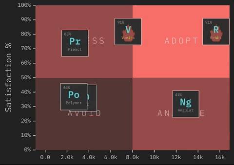

# Empleos React en España

Según la encuesta [State of JavaScript 2018](https://2018.stateofjs.com/), es un buen momento para adoptar React y Vue. El mercado también lo refleja y continuamente surgen nuevas ofertas para trabajar en React.
 

Como profesor de React recibo muchas ofertas dirigidas a mis alumnos o a mi. Cada oferta se redacta diferente y es complicado para el candidato encontrar los datos clave para decantarse entre una oferta u otra.

Este proyecto es una solución sencilla para resolver el problema, agrupando y homogeneizando ofertas de trabajo para programadores React en España.

|                        Empresa empleadora | Tipo empresa | Años experiencia | Salario mínimo | Salario máximo |                              Lugar | Porcentaje remoto | Capa de datos | Azucar sintáctico |       Testing | Backend |                                       Url o Email contacto |
| ----------------------------------------  | -----------  | ---------------  | -------------  | -------------  | ---------------------------------  | ----------------  | ------------  | ----------------  | ------------  | ------  | --------------------------------------------------------- |
|                     Belbex (Grupo CoStar) |     Producto |                4 | 30k€ | 52k€ |           Barrio Salamanca, Madrid | 20% |         Redux |               ES6 |          Otro |    Node | [link](mailto:nsanchez@talentsearchpeople.com) |
|                             Nombre oculto |     Producto |                5 | 30k€ | 55k€ |                             Madrid | 20% |       GraphQL |               ES6 |          Jest |    Node | [link](mailto:teresa.quintana@e-frontiers.ie) |
|                                     Ciber |  Consultoria |                3 | 25k€ | 35k€ |                  Hortaleza, Madrid | 20% |          Otra |        Typescript |          Otro |    Java | [link](mailto:ana.galego@ciberexperis.es) |
|                                       CTI |  Consultoria |                3 | 30k€ | 36k€ |                 Alcobendas, Madrid | No |         Redux |               Elm |          Otro |    Java | [link](mailto:rrhh@ctisoluciones.com) |
|                                  Bclubber |     Producto |                3 | 30k€ | 45k€ |                  Las Rozas, Madrid | 40% |       GraphQL |        Typescript |          Jest |    Ruby | [link](mailto:juan.partida@bclubber.com) |
|                                  Spacefit |     Producto |                1 | 16k€ | 24k€ |                   Ruzafa, Valencia | 40% |       GraphQL |        Typescript |          Jest |    Node | [link](https://blog.spacefit.app/jobs/) |
|               Irium Soluciones y Sistemas |  Consultoria |                3 | 28k€ | 40k€ |                 Alcobendas, Madrid | No |         Redux |               ES6 |       Jasmine |    Node | [link](mailto:kliendo@irium.es) |
|                                   Nexttic |     Producto |                4 | 40k€ | 48k€ |         Pozuelo de Alarcón, Madrid | 20% |         Redux |               ES6 |         Karma |    Node | [link](mailto:fiore@nexttic.com) |
|                             Nombre oculto |  Consultoria |                1 | 30k€ | 40k€ |                      Madrid Centro | No |         Redux |              Flow |          Jest |    Java | [link](mailto:ana.martin@madison.kay.com) |
|                                   Bluetab |     Producto |                1 | 22k€ | 32k€ |                   Bernabeu, Madrid | 20% |         Redux |               ES6 |          Jest |  Python | [link](mailto:neil.menzies@bluetab.net) |
|                 Profile Software Services |  Consultoria |                3 | 35k€ | 40k€ | San Sebastian de Los Reyes, Madrid | 20% |         Redux |               ES6 | Jest + Eznyme |    Java | [link](mailto:alberto.sanchez@sectorea.com) |
| Nombre oculto (Software gestión notarial) |     Producto |                2 | 35k€ | 40k€ |   Parque Emp. Las Mercedes, Madrid | No |          Otra |              Otro |          Otro |    Java | [link](mailto:eperez@catenon.com) |
|                                      Badi |     Producto |                4 | 40k€ | 50k€ |                          Barcelona | 4% |         Redux |              Otro |          Jest |    Ruby | [link](https://jobs.badi.com/jobs/149689-senior-frontend-engineer) |
|                            Undefined Labs |     Producto |                3 | 55k€ | 75k€ |                  Recoletos, Madrid | 10% |       GraphQL |               ES6 |          Jest |  Python | [link](http://undefinedlabs.com/careers) |
|                                   Keytree |  Consultoria |                2 | 25k€ | 45k€ |                   Gran Vía, Madrid | 40% |         Redux |               ES6 |          Otro |    Java | [link](mailto:nerea.decastro@keytree.es) |
|                                     Datio |  Consultoria |                2 | 30k€ | 40k€ |         Pozuelo de Alarcón, Madrid | 20% |         Redux |               ES6 |          Jest |    Java | [link](mailto:ilao@datiobd.com) |
|                                   Xpertai |     Producto |                3 | 30k€ | 35k€ |                 Glòries, Barcelona | 20% |         Redux |               ES6 |          Jest |  Python | [link](mailto:oriol.caseny@walterspeople.com) |
|                             Nombre oculto |  Consultoria |                2 | 28k€ | 34k€ |                        Sol, Madrid | 20% |         Redux |               ES6 |          Otro |    Java | [link](mailto:miguelaguado@pagepersonnel.es) |
|                            Undefined Labs |     Producto |                3 | 55k€ | 75k€ |                  Recoletos, Madrid | 10% |       GraphQL |               ES6 |          Jest |  Python | [link](http://undefinedlabs.com/careers) |
|                                   Keytree |  Consultoria |                2 | 25k€ | 45k€ |                   Gran Vía, Madrid | 40% |         Redux |               ES6 |          Otro |    Java | [link](mailto:nerea.decastro@keytree.es) |
|                                     Datio |  Consultoria |                2 | 30k€ | 40k€ |         Pozuelo de Alarcón, Madrid | 20% |         Redux |               ES6 |          Jest |    Java | [link](mailto:ilao@datiobd.com) |
|                                   Xpertai |     Producto |                3 | 30k€ | 35k€ |                 Glòries, Barcelona | 20% |         Redux |               ES6 |          Jest |  Python | [link](mailto:oriol.caseny@walterspeople.com) |

### Contribuir

Si quieres publicar tu oferta de empleo [rellena este formulario](https://goo.gl/forms/3mShRHUI6LgUydXZ2).
